<div align="center">

# AI-Powered Real-Time Exercise Form Analysis

**A webcam-based fitness coach that tracks your body, scores every rep from 0 to 100 and tells you exactly what to fix, running in real time on a CPU-only laptop.**

[](https://www.python.org/)
[](https://ai.google.dev/edge/mediapipe/solutions/vision/pose_landmarker)
[](https://opencv.org/)
[](https://numpy.org/)


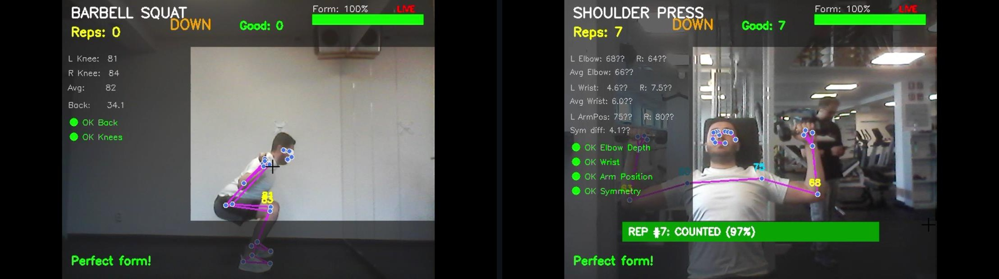

<sub>Live sessions: barbell squat (left) and shoulder press in a gym (right). All indicators are green and the form score is 100%.</sub>

</div>

---

## Table of Contents

- [Overview](#overview)
- [Key Features](#key-features)
- [Demo](#demo)
- [How It Works](#how-it-works)
- [Exercise Rules and Scoring](#exercise-rules-and-scoring)
- [Results](#results)
- [Getting Started](#getting-started)
- [Usage](#usage)
- [Adding a New Exercise](#adding-a-new-exercise)
- [Design Decisions](#design-decisions)
- [Limitations](#limitations)
- [Roadmap](#roadmap)
- [Academic Context](#academic-context)
- [Author](#author)

---

## Overview

Poor exercise technique is one of the most common causes of training injuries, yet most people who train at home or alone have no one to check their form. Commercial solutions exist, but they rely on subscriptions, dedicated hardware or wearable sensors.

This project is the practical part of my **Master's thesis in Informatics** at the **Czech University of Life Sciences Prague**. I set out to show that detailed, useful form feedback needs no lab, no special sensors and no GPU, only **a laptop and a webcam**.

The system:

1. detects **33 body landmarks** in every frame with **Google MediaPipe Pose**,
2. computes **joint angles** with vector trigonometry and smooths them with a **7-frame moving-average filter**,
3. evaluates each frame against **biomechanically grounded rules** (forward lean, knee valgus, elbow flare, wrist alignment, left/right asymmetry and more),
4. counts repetitions with a **finite-state machine** and gives each rep a **0–100 quality score** with named error labels, and
5. renders a **heads-up display (HUD)** with live angles, color-coded indicators and specific corrective messages.

Two compound lifts are currently supported: the **Barbell Squat** and the **Shoulder Press**. The object-oriented architecture lets you add a new exercise by writing a single subclass.

---

## Key Features

| | Feature | Details |
|---|---|---|
| 🎯 | **Real-time pose tracking** | MediaPipe Pose (BlazePose, *Full* model) with 33 landmarks at **25–30 FPS** on an Intel i5-8250U with no GPU |
| 📐 | **Joint-angle engine** | `arctan2`-based 3-point joint angles and deviation-from-vertical measurements |
| 🧹 | **Noise suppression** | Per-angle 7-frame moving average that cuts angle jitter by **~75%** (σ 3.2° → 0.8°) |
| 🧠 | **Rule-based scoring** | Every penalty maps to a named biomechanical principle, so each result can be explained and no training data is needed |
| 🔁 | **Rep counting** | Two-state (`down` → `up`) automaton with hysteresis, so partial movements and jitter are not counted |
| 🚫 | **Quality gates** | Partial squats are cancelled, and shoulder-press reps are checked for full range of motion |
| 🖥️ | **Rich visual feedback** | Semi-transparent HUD, live angle labels on the joints, a red/yellow/green score bar, "sticky" error messages and per-rep result banners |
| 📊 | **Session summary** | Per-rep breakdown with total reps, good reps, average score and detected errors |
| 🧩 | **Extensible OOP design** | `BaseAnalyzer` (Template Method pattern) plus one subclass per exercise |

---

## Demo

### Barbell Squat

| Correct form | Excessive forward lean |
|:---:|:---:|
| 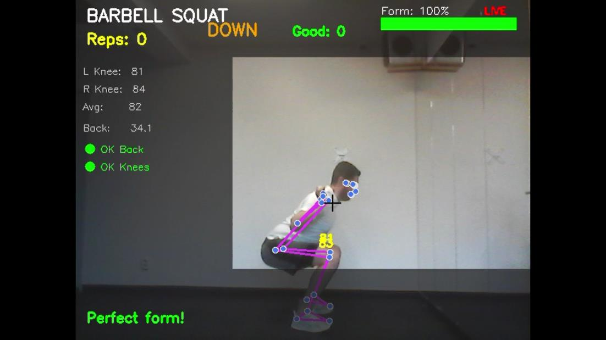 | 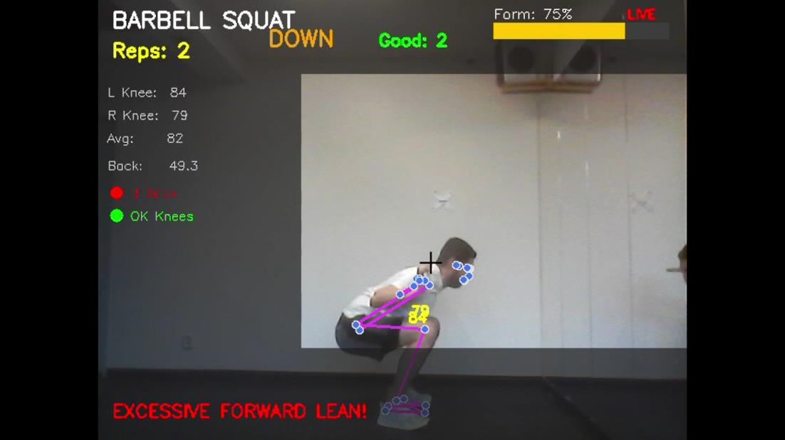 |
| Back 34.1° (< 40°), knees 81°/84°, **score 100%** | Back 49.3° is over the 40° threshold, so the rep loses **25 points** |
| **Knee valgus (knees caving in)** | **Partial squat** |
| 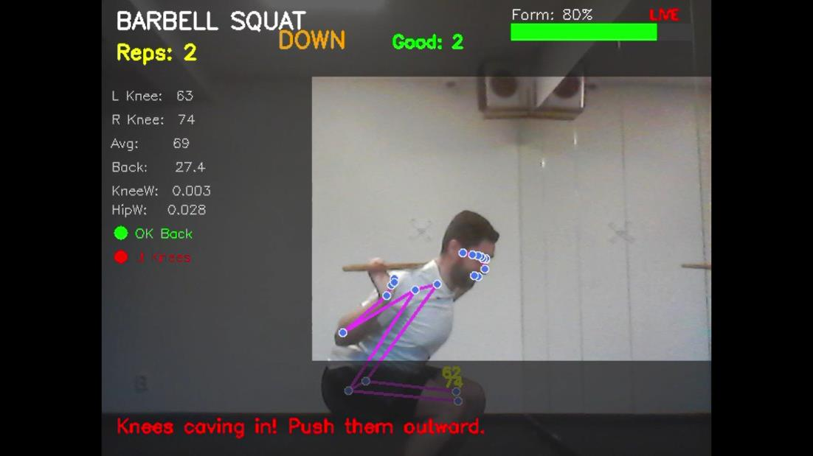 | 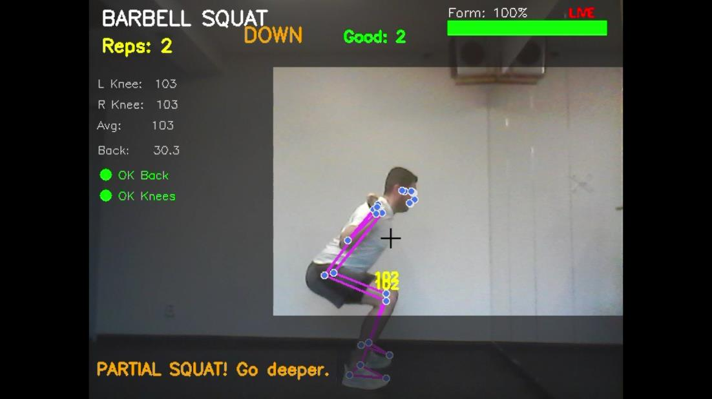 |
| Knee gap 0.003 vs. hip gap 0.028 (< 60%), **−20 pts** | Min. knee angle 103° is above the 90° depth gate, so the **rep is not counted** |

### Shoulder Press

| Correct form | Elbow flare |
|:---:|:---:|
| 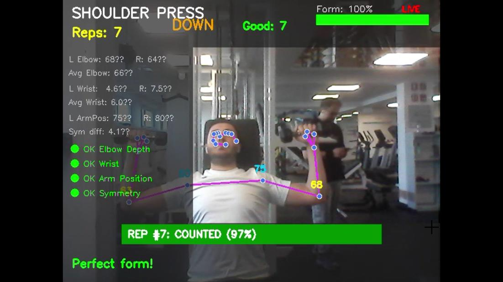 | 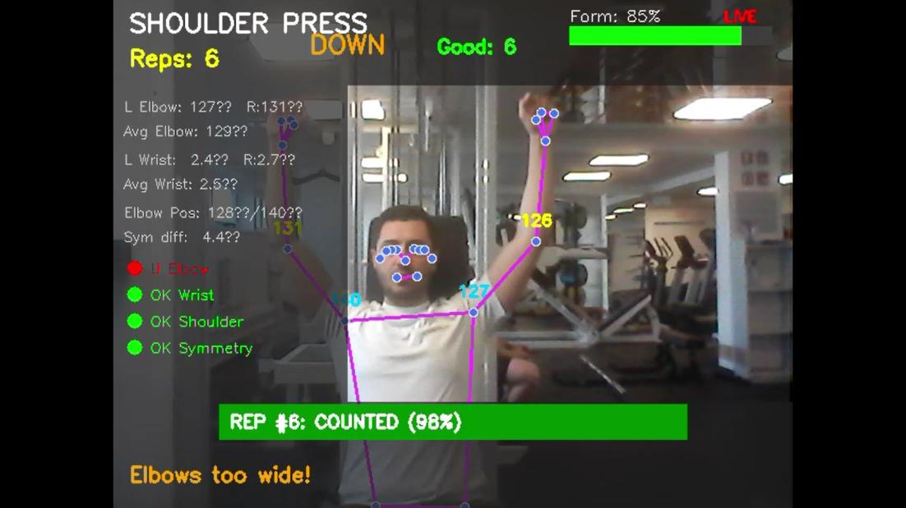 |
| All 4 indicators green, **rep #7 counted at 97%** | Upper-arm angle 128°/140° is outside the 70–110° range |
| **Bilateral asymmetry** | **Multiple simultaneous errors** |
| 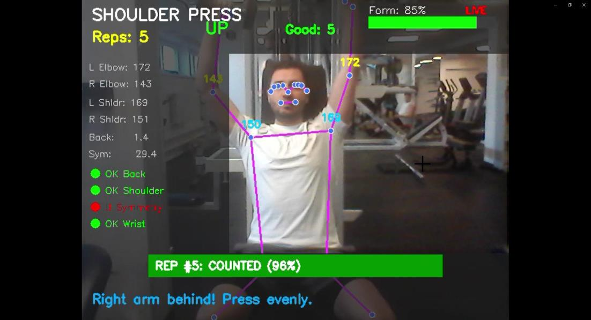 | 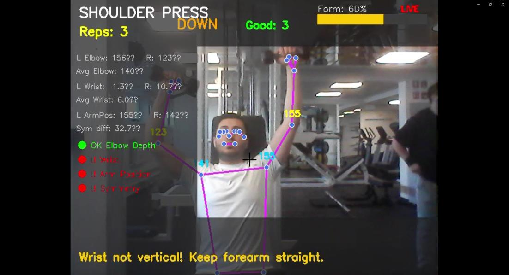 |
| L 172° vs. R 143°, a 29.4° difference (threshold 10°) | Wrist 10.7°, asymmetry 32.7° and arm position all flagged at once, **score 60%** |

<details>
<summary><b>One more example: elbows too low</b></summary>
<br>
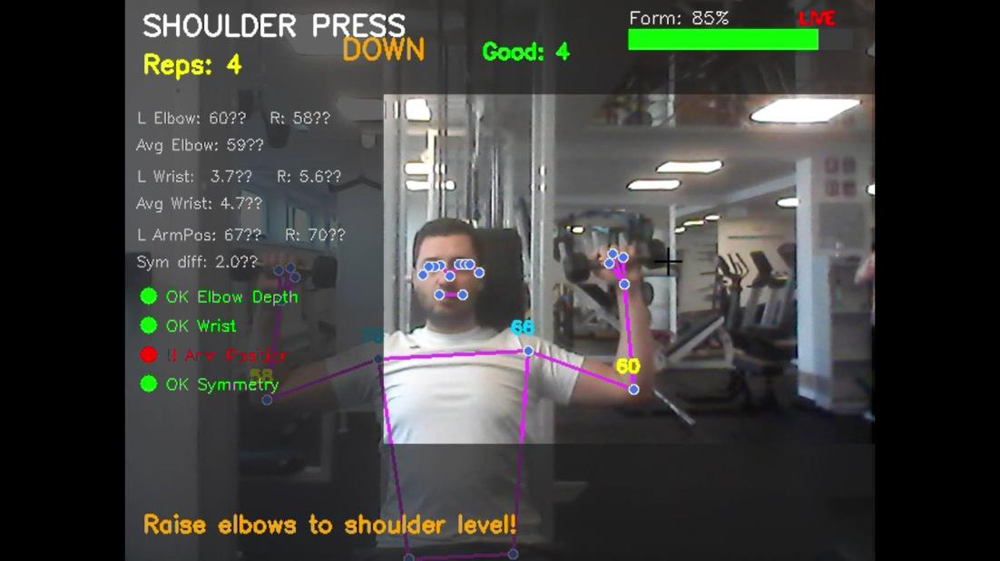

Arm position 67°/70° is below the lower bound of the 70–110° range, so the system shows *"Raise elbows to shoulder level!"*
</details>

---

## How It Works

### Processing pipeline

Every frame goes through the same seven stages:


### Architecture

The code is organized into three independent layers: **helper functions** (pure geometry), **analyzer classes** (form logic, scoring, drawing) and the **runtime layer** (camera loop, menu, console output).

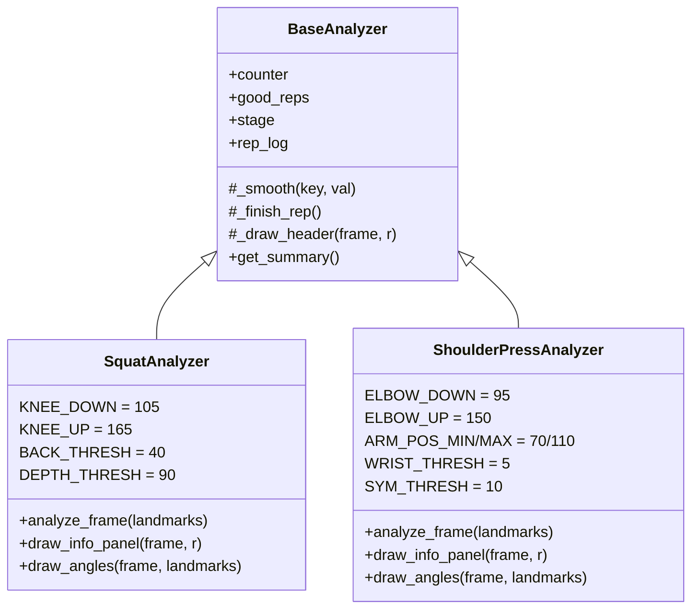

### Core algorithms

**Three-point joint angle.** This gives the interior angle at vertex *b*, for example hip–**knee**–ankle:

```python
def angle3(a, b, c):
    ang = abs(degrees(arctan2(c.y - b.y, c.x - b.x) - arctan2(a.y - b.y, a.x - b.x)))
    return 360 - ang if ang > 180 else ang
```

**Deviation from vertical.** This is used for the torso lean (hip midpoint → shoulder midpoint) and the forearm tilt (elbow → wrist). The y-axis is inverted because image coordinates grow downward.

**Noise filter.** Each measured angle has its own `deque(maxlen=7)`. Seven frames (≈230 ms at 30 FPS) came out of testing as the best trade-off: 3–5 frames still left visible jitter, and 10–15 frames made the display lag noticeably behind the movement.

**Rep scoring.** Every frame starts at 100 points, and each detected error subtracts a penalty scaled to its severity. A rep's score is the **average frame score** over the whole rep. A rep scoring **≥ 60** counts as *good*, which means the form must be correct for most of the movement while brief transitional deviations are tolerated.

**Rep counting.** A two-state automaton with separate *down* and *up* thresholds (hysteresis) counts a rep only on a complete `down → up` transition.

---

## Exercise Rules and Scoring

### Barbell Squat: 3 criteria

| Criterion | How it's measured | Threshold | Effect | Why it matters |
|---|---|---|---|---|
| **Forward lean** | Hip-midpoint → shoulder-midpoint vs. vertical | > 40° | −25 pts · `back_lean` | Increases lumbar spine loading |
| **Knee valgus** | Knee gap vs. hip gap (only during the *down* phase) | < 60% of hip width | −20 pts · `knee_valgus` | Inward knee collapse is a known ACL injury risk factor |
| **Depth** | Minimum knee angle during the rep | > 90° | **Rep cancelled** | A partial range of motion should not count as a rep |

Rep cycle: knee angle **< 105°** marks the rep as *down*, and a return to **> 165°** completes it as *up*.

### Shoulder Press: 4 criteria + ROM check

| Criterion | How it's measured | Threshold | Effect |
|---|---|---|---|
| **Elbow over-flexion** | Shoulder–elbow–wrist angle | < 45° | −20 pts · `elbow_overflexed` |
| **Arm position** | Hip–shoulder–elbow angle (*down* phase) | outside 70°–110° | −15 pts · `elbow_low` / `elbow_flare` |
| **Bilateral symmetry** | abs(left elbow − right elbow) | > 10° | −15 pts · `asymmetry` |
| **Wrist alignment** | Forearm deviation from vertical (*down* phase) | > 5° | −10 pts · `wrist_angle` |
| **Range of motion** | max − min elbow angle within the rep | < 45° | `partial_rom` flag |

Rep cycle: elbow angle **< 95°** marks the rep as *down*, and a return to **> 150°** completes it as *up*.

---

## Results

All measurements come from the thesis evaluation on an **ASUS X510UAR** laptop (Intel Core i5-8250U @ 1.6 GHz, 16 GB RAM, Intel UHD 620 integrated graphics, 480p webcam), with **no GPU acceleration**.

### Performance

| Metric | Value |
|---|---|
| Frame rate | **25–30 FPS** (MediaPipe *Full* model) |
| CPU usage | 35–45% of one core on average (~60% peak) |
| Memory | 180–220 MB, stable, with no leaks over 30-minute sessions |
| Startup time | 2–3 s |
| Angle jitter while standing still | σ **3.2° → 0.8°** with the filter (**−75%**) |

**Choosing the MediaPipe model complexity:**

| Model | FPS | Smoothness | Landmark accuracy |
|---|---|---|---|
| 0 · Lite | 30–35 | Excellent | Good |
| **1 · Full (used)** | **25–30** | **Good** | **Very good** |
| 2 · Heavy | 15–20 | Noticeable lag | Excellent |

### Form-classification accuracy

The system was tested on 30 structured reps per exercise, with correct form, single deliberate errors and borderline cases.

| Exercise | Correctly classified | Accuracy |
|---|---|---|
| Barbell Squat | 27 / 30 | **90%** |
| Shoulder Press | 25 / 30 | **83%** |

<details>
<summary><b>Detailed breakdown</b></summary>

**Squat**

| Actual form | Reps | Correct | False pos. | False neg. | Notes |
|---|---|---|---|---|---|
| Correct form | 10 | 10 | 0 | 0 | All scored 85–98 |
| Forward lean | 8 | 7 | 0 | 1 | Missed a mild lean at 42° |
| Knee valgus | 7 | 5 | 0 | 2 | Caused by the camera angle |
| Partial depth | 5 | 5 | 0 | 0 | All correctly cancelled |

**Shoulder Press**

| Actual form | Reps | Correct | False pos. | False neg. | Notes |
|---|---|---|---|---|---|
| Correct form | 10 | 9 | 1 | 0 | Wrist at 5.2° (threshold 5°) |
| Asymmetry | 6 | 6 | 0 | 0 | All detected |
| Wrist misalignment | 6 | 4 | 0 | 2 | Borderline cases |
| Elbow flare | 4 | 3 | 0 | 1 | Slight flare missed |
| Partial ROM | 4 | 3 | 1 | 0 | 44° ROM (threshold 45°) |

</details>

Most misclassifications were **borderline cases** sitting right at a threshold. The thresholds are intentionally conservative, so **false negatives outnumber false positives**. For a coaching tool this is a deliberate choice: it is better to let a borderline rep pass than to nag the user about form that is actually acceptable.

### How it compares

| | **This project** | Commercial apps | Wearable sensors | Motion capture |
|---|---|---|---|---|
| Hardware | Webcam only | Phone / special HW | IMU sensors | Marker suit + cameras |
| Cost | **Free** | $10–100 / month | $50–500 | $10,000+ |
| Real-time | **Yes (25–30 FPS)** | Limited | Yes | Post-processing |
| Accuracy | Moderate | Low–Moderate | High | Very high |
| Extensible | **Yes (open source)** | No (proprietary) | Moderate | High |

---

## Getting Started

### Requirements

- Python **3.8–3.11** (recommended: 3.10)
- A webcam (a built-in laptop camera is enough)
- No GPU required

### Installation

```bash
git clone https://github.com/<hakan00>/<exercise_form_analysis>.git
cd <exercise_form_analysis>

python -m venv venv
# Windows: venv\Scripts\activate
source venv/bin/activate

pip install -r requirements.txt
```

> **Note:** The project uses MediaPipe's classic `mp.solutions.pose` API. Newer MediaPipe releases have removed this legacy API, so `requirements.txt` pins a compatible version.

### Run

```bash
python exercise_form_analysis.py
```

```
  EXERCISE FORM ANALYSIS
  ─────────────────────
  [1] Barbell Squat
  [2] Shoulder Press
  [Q] Quit
  Choice:
```

---

## Usage

### Keyboard controls

| Key | Action |
|---|---|
| `Q` / `Esc` | Quit and print the session summary |
| `R` | Reset all counters and scores |
| `P` | Pause / resume the video |
| `S` | Print the current session summary without quitting |

### Recommended setup

- **Distance:** 1.5–2.5 m from the camera, with the whole body visible.
- **Angle:** about 30–45° from the front. This captures enough of the side view for depth and back angle and enough of the front for knee valgus.
- **Lighting:** a well-lit room. Dim light (below ~50 lux) causes landmark jumps.

### Example session summary (illustrative)

```
==================================================
  BARBELL SQUAT — SESSION SUMMARY
==================================================
  Total: 5  |  Good: 4  |  Avg: 83.2/100
  ──────────────────────────────────────────────
  Rep # 1   96/100  [GOOD]  —
  Rep # 2   94/100  [GOOD]  —
  Rep # 3   71/100  [GOOD]  back_lean
  Rep # 4   58/100  [LOW]   back_lean, knee_valgus
  Rep # 5   97/100  [GOOD]  —
==================================================
```

---

## Adding a New Exercise

Shared logic (smoothing, scoring, rep logging and the HUD header) lives in `BaseAnalyzer`. A new exercise is **one subclass with three methods**, and the core stays untouched:

```python
class DeadliftAnalyzer(BaseAnalyzer):
    EXERCISE_NAME = "DEADLIFT"

    def analyze_frame(self, landmarks):
        # 1. extract landmarks with pt(), 2. compute angles with angle3()/vert_angle()
        # 3. smooth with self._smooth(), 4. apply penalties + self._rep_errs
        # 5. update the down/up state machine and call self._finish_rep()
        ...

    def draw_info_panel(self, frame, r):
        self._draw_header(frame, r)
        ...

    def draw_angles(self, frame, landmarks):
        ...

EXERCISES["3"] = ("Deadlift", DeadliftAnalyzer)
```

---

## Design Decisions

**Rule-based rather than machine-learning scoring.** Hand-written rules are *transparent*: every penalty traces back to a named biomechanical criterion, so the user knows exactly what to fix and a wrong threshold is one number to change. Rules also need **no labeled training data**, so a new exercise can be supported as soon as its criteria are written down. A machine-learning layer remains a natural next step for the borderline cases (see the [Roadmap](#roadmap)).

**Empirical threshold calibration.** The first values came straight from the literature and proved too strict in practice. For example, the knee-valgus threshold started at 80% of hip width, but normal anatomy narrows the knees to ~65–70% at the bottom of a deep squat, so it was lowered to **60%**. The back-angle limit was tested at 30°, which produced false alarms, and at 50°, which was too lenient, before settling at **40°**.

**Sticky feedback messages.** Error messages stay on screen for at least **60 frames (~2 s)** after the error clears. Without this they flicker too quickly to read during a rep.

**Performance-aware rendering.** All HUD panels are drawn on one overlay and blended with a **single** `cv2.addWeighted` call. This recovered the 5–8 FPS that the first overlay implementation cost.

**Single file, three dependencies.** About 500 lines of Python with only OpenCV, MediaPipe and NumPy, so the project installs and runs in a couple of minutes.

---

## Limitations

- **2D analysis only.** The z-axis is not used yet, so movement toward or away from the camera is measured less accurately.
- **One test subject.** The evaluation was done on my own body, which is a single body type and fitness level. The thresholds need validation across a more diverse group.
- **Camera placement matters.** Knee-valgus detection in particular depends on the viewing angle.
- **Single-person tracking** and sensitivity to **poor lighting**.
- **Two exercises** so far, though the architecture is built to add more.

---

## Roadmap

- [ ] Visibility-score gating, which skips form checks when landmarks are unreliable
- [ ] 3D analysis using MediaPipe's z-coordinates or a stereo/depth camera
- [ ] More exercises: deadlift, bench press, lunges, pull-ups
- [ ] A hybrid **rule + ML** scoring layer, with personalized thresholds from body proportions
- [ ] Audio (voice) feedback
- [ ] Session history and progress tracking
- [ ] A mobile version
- [ ] An on-screen camera-placement guide for each exercise

---

## Academic Context

This repository contains the implementation for my Master's thesis:

> **Özer, H.** (2026). *AI-Powered Real-Time Exercise Form Analysis Using Pose Estimation.* Master's Thesis, Faculty of Economics and Management, Czech University of Life Sciences Prague.
> Supervisor: doc. Ing. Arnošt Veselý, CSc.

The thesis combines a literature review of pose estimation (from DeepPose and OpenPose to BlazePose) and exercise biomechanics with the design, implementation and empirical evaluation of the system described here.

<details>
<summary><b>Key references</b></summary>

- Bazarevsky, V. et al. *BlazePose: On-device Real-time Body Pose Tracking.* CVPR Workshop, 2020.
- Lugaresi, C. et al. *MediaPipe: A Framework for Building Perception Pipelines.* 2019.
- Cao, Z. et al. *OpenPose: Realtime Multi-Person 2D Pose Estimation Using Part Affinity Fields.* IEEE TPAMI, 2021.
- Schoenfeld, B. J. *Squatting Kinematics and Kinetics and Their Application to Exercise Performance.* JSCR, 2010.
- Hewett, T. E. et al. *Biomechanical Measures of Neuromuscular Control and Valgus Loading of the Knee Predict ACL Injury Risk.* AJSM, 2005.
- Escamilla, R. F. et al. *Shoulder Muscle Activity and Function in Common Shoulder Rehabilitation Exercises.* Sports Medicine, 2009.

</details>

---

## Tech Stack

`Python` · `MediaPipe Pose (BlazePose)` · `OpenCV` · `NumPy` · Computer vision · Human pose estimation · Real-time processing · Object-oriented design

---

## Author

**Hakan Özer**
MSc in Informatics, Czech University of Life Sciences Prague

[](https://www.linkedin.com/in/<hakan0>)
[](mailto:<hakan.ozer.95@hotmail.com>)

If you find this project interesting, feel free to ⭐ the repository or reach out.

---

## License

This project is released under the [MIT License](LICENSE).
